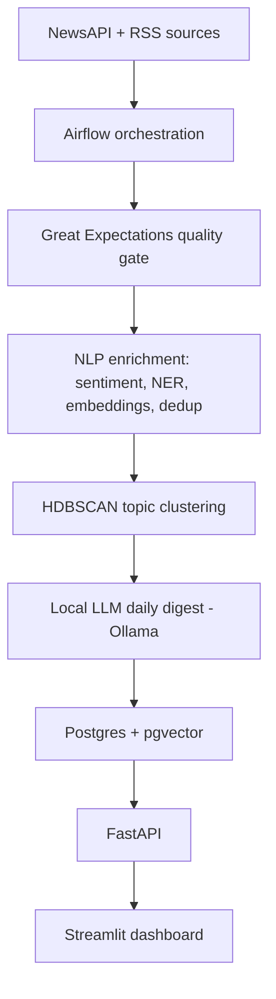

# News Analytics Pipeline v2

An end-to-end news analytics pipeline: ingestion, data-quality validation,
NLP enrichment (sentiment, NER, embeddings), semantic deduplication, topic
clustering, and LLM-generated daily digests -- served through a FastAPI
backend and a Streamlit dashboard.

Built as a redesign of an earlier NewsAPI -> Airflow -> Postgres -> Streamlit
project, extended with embeddings, sentiment/entity extraction, topic
clustering, and a local LLM digest layer, plus a real API boundary between
storage and presentation.

## Architecture



Five Airflow tasks run hourly: `ingest -> quality_gate -> enrich ->
cluster_topics -> generate_digest`.

## Tech stack

| Layer | Tools |
|---|---|
| Orchestration | Apache Airflow 2.9 |
| Database | PostgreSQL 16 + pgvector |
| Data quality | Great Expectations |
| NLP | sentence-transformers (embeddings), spaCy (NER), VADER (sentiment) |
| Topic modeling | HDBSCAN |
| LLM digest | Ollama (phi3:mini), local, zero API cost |
| Serving | FastAPI |
| Dashboard | Streamlit |
| CI | GitHub Actions |

## Features

- **Ingestion**: pulls from NewsAPI and RSS feeds, deduplicates on URL hash,
  supports incremental backfill.
- **Quality gate**: Great Expectations validates every batch before it's
  used downstream; failing records are quarantined, not silently dropped.
- **Enrichment**: sentiment scoring, named-entity extraction, and 384-dim
  sentence embeddings for every article, with semantic near-duplicate
  detection via pgvector cosine similarity (catches syndicated wire stories
  that plain URL dedup misses).
- **Topic clustering**: HDBSCAN groups articles into topics without a
  pre-set number of clusters; each topic gets an auto-generated label from
  its top terms.
- **Daily digest**: a local LLM (Ollama, no external API calls) summarizes
  each active topic cluster once a day.
- **API + dashboard**: FastAPI serves articles, topic trends, digests, and
  semantic search; Streamlit consumes only the API, never the database
  directly, keeping a clean service boundary.

## Two ways to run it

This repo supports both a Dockerized setup and a fully native setup. The
native setup is what's actively maintained and documented below; the
`docker-compose.yml` and `Dockerfile` are kept for reference and as a
"containerized, reproducible" deployment story, but weren't the primary
development path for this build.

### Native setup (WSL2, no Docker)

Airflow does not run on native Windows, so this runs inside WSL2 (Ubuntu).
Everything else (Postgres, the API, the dashboard, Ollama) could run on
native Windows too, but keeping it all in one WSL2 environment avoids a lot
of cross-boundary networking friction.

**Why two separate Python virtual environments?** Airflow's dependency
constraints pin an older `typing-extensions` than the FastAPI/pydantic/torch
stack needs, so installing everything into one venv creates a broken
environment. `~/airflow-venv` runs Airflow only; `~/news-pipeline-venv` runs
everything else (torch, spaCy, sentence-transformers, FastAPI, Streamlit).
Airflow's DAG hands off each task to `~/news-pipeline-venv` via
`ExternalPythonOperator`, which runs each task as a subprocess in that venv
instead of importing its libraries into Airflow's own process.

1. Install a plain Ubuntu WSL2 distro: `wsl --install -d Ubuntu-24.04`
2. Install Python, Postgres, and pgvector:
   ```
   sudo apt install -y python3.12-venv postgresql postgresql-contrib build-essential
   sudo apt install -y postgresql-16-pgvector
   ```
3. **If you already have a native Windows PostgreSQL install**, it very
   likely occupies port 5432. This project's WSL2 Postgres runs on **5433**
   instead to avoid any conflict -- set the port in
   `/etc/postgresql/16/main/postgresql.conf` before first use.
4. Create the database and load the schema:
   ```
   sudo -u postgres psql -c "CREATE DATABASE news_pipeline;"
   sudo -u postgres psql -p 5433 -d news_pipeline -f db/schema.sql
   ```
5. Create the two venvs:
   ```
   python3.12 -m venv ~/news-pipeline-venv
   source ~/news-pipeline-venv/bin/activate
   pip install torch --index-url https://download.pytorch.org/whl/cpu
   pip install -r requirements.txt
   python -m spacy download en_core_web_sm
   pip install dill  # needed for ExternalPythonOperator's cross-venv calls
   deactivate

   python3.12 -m venv ~/airflow-venv
   source ~/airflow-venv/bin/activate
   pip install "apache-airflow==2.9.3" \
     --constraint "https://raw.githubusercontent.com/apache/airflow/constraints-2.9.3/constraints-3.12.txt"
   ```
6. Set `AIRFLOW_HOME=~/airflow_home` and point `dags_folder` in
   `airflow.cfg` at this repo's `dags/` directory.
7. In `dags/news_pipeline_dag.py`, confirm `EXTERNAL_PYTHON` points at your
   `~/news-pipeline-venv/bin/python`.
8. **Ollama**: install natively on Windows, set the `OLLAMA_HOST=0.0.0.0`
   environment variable, and fully restart the app (the variable only takes
   effect on a fresh process start). If WSL2 still can't reach it via
   `curl http://localhost:11434/api/tags`, switch WSL2 to mirrored
   networking mode (`.wslconfig` -> `[wsl2]` -> `networkingMode=mirrored`,
   then `wsl --shutdown`), and add a Windows Firewall rule for port 11434 if
   it times out rather than connecting.
9. Run `bash scripts/startup.sh` each session -- it starts Postgres
   correctly, checks Ollama connectivity, and launches Airflow.
10. Open `localhost:8080` for Airflow, unpause `news_analytics_pipeline_v2`.
11. In a separate terminal (news-pipeline-venv activated):
    ```
    uvicorn api.main:app --reload --port 8000
    streamlit run dashboard/app.py
    ```
    API docs: `localhost:8000/docs`. Dashboard: `localhost:8501`.

### Docker setup

```
docker compose up --build
```
See `Dockerfile` and `docker-compose.yml`. Note: installing `torch` without
forcing the CPU-only wheel pulls several GB of unnecessary CUDA
dependencies -- the `Dockerfile` installs it via
`--index-url https://download.pytorch.org/whl/cpu` first for exactly this
reason.

## Known limitations

- **Small-model hallucination**: the digest step uses `phi3:mini` (3.8B
  parameters) for zero API cost. It occasionally introduces details not
  present in the source articles (an LLM limitation, not a pipeline bug).
  A larger model, stricter grounding in the prompt, or a fact-check pass
  would reduce this.
- **HDBSCAN cluster threshold**: `min_cluster_size` is currently set low
  (3) to produce usable clusters at low article volume. As the pipeline
  accumulates more data from repeated scheduled runs, this should be raised
  back toward the library default (5) for more statistically meaningful
  clusters.
- **Single-node, dev-oriented**: `airflow standalone` and SQLite metadata
  storage are explicitly for local development, not production.

## License

MIT
